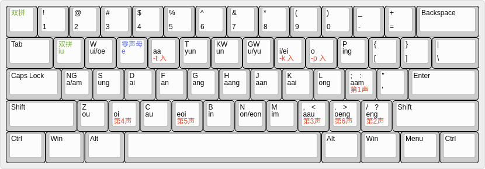
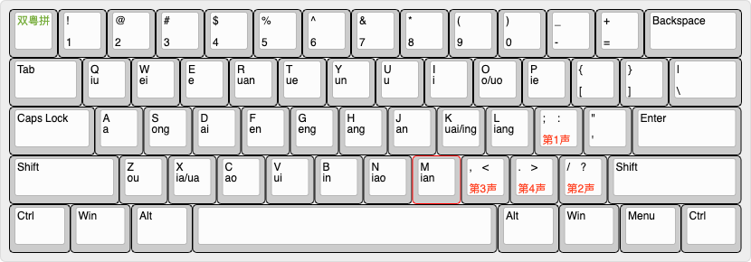

# fcitx-rime-config

This repository includes my Double Jyutping with Optional Tones IME for [RIME](https://rime.im/), Flypy Double Pinyin with Optional Tones, as well as a number of other input methods for RIME.

## Double Jyutping with Optional Tones (双粤拼)

All syllables in Cantonese (粤语 / 广东话) can be entered unambiguously with 2 keystrokes (or 3 for entering tone, ie ending with -p -t -k). The diagram above is described according to the [Jyutping](https://en.wikipedia.org/wiki/Jyutping) (粤拼) standard.

You can optionally enter a tone with 1 additional keystroke - 1 is `;`, 2 is `/`, 3 is `,`, 4 is `x`, 5 is `v`, 6 is `.`. For instance, 师 is `si;` 史 is `si/` 试 is `si.` 时 is `six` 市 is `siv` 是 is `si.`

"ng" 五 is entered by typing `aa`

"m" 唔 is entered by typing `mm`

Syllables ending in -p -t -k are entered with 3 keys, where the last one is either `r` (for -t), `i` (for -k) or `o` (for -p). For example, "gat" 吉 is `gar`, "faat" 发 is `frr`, "gik" 极 is `gii`, "ngok" 岳 is `aoi`, "goek" 脚 is `gwi`

For initials which can be followed by either i or ei (d, n, s), -ei gets relocated to the `w` key. So "sei" 四 is `sw`, "si" 师 is `si`. For all other initials (g, f, k, p, b, m, l), -ei remains on the `i` key, so "gui" 攰 is `gw`, "gei" 机 is `gi`.

For null initial, use `e`. So "on" 安 is `en`, "uk" 屋 is `eui`, "oi" 爱 is `ex`, "aa" 啊 is `er`, "ak" 喔 is `eai`, "am" 暗 is `ea`

You can type either `q` or "\`" to temporarily switch to Cantonese lookup mode, if you don't know the Cantonese pronunciation for a word. In this mode you can enter words using the Flypy Double Pinyin method described below, and it will display the Jyutping next to the Chinese characters.

It is implemented by [double_jyutping.schema.yaml](https://github.com/gkovacs/fcitx-rime-config/blob/master/double_jyutping.schema.yaml) in this repository. The [keyboard layout diagram](http://www.keyboard-layout-editor.com/) is [double-jyutping.json](https://github.com/gkovacs/fcitx-rime-config/blob/master/double-jyutping.json).

## Flypy Double Pinyin with Optional Tones (小鹤双拼)

This is identical to the standard Flypy Double Pinyin 小鹤双拼 and adds the ability to optionally add tones.

All syllables in Standard Chinese (Mandarin / Putonghua / 普通话) can be entered unambiguously with 2 keystrokes.

You can optionally enter a tone with 1 additional keystroke - 1 is `;`, 2 is `/`, 3 is `,`, 4 is `.`. For instance, 师 is `ui;` 时 is `ui/` 使 is `ui,` 是 is `ui.`

You can type "\`" to temporarily switch to Cantonese lookup mode, if you don't know the Putonghua pronunciation for a word. In this mode you can enter words using the Double Jyutping method described above, and it will display the Pinyin next to the Chinese characters.

It is implemented by [td_pinyin_flypy_jyutping.schema.yaml](https://github.com/gkovacs/fcitx-rime-config/blob/master/td_pinyin_flypy_jyutping.schema.yaml) in this repository. The [keyboard layout diagram](http://www.keyboard-layout-editor.com/) is [double-flypy.json](https://github.com/gkovacs/fcitx-rime-config/blob/master/double-flypy.json)

## License

MIT License

## Author

[Geza Kovacs](https://github.com/gkovacs)
