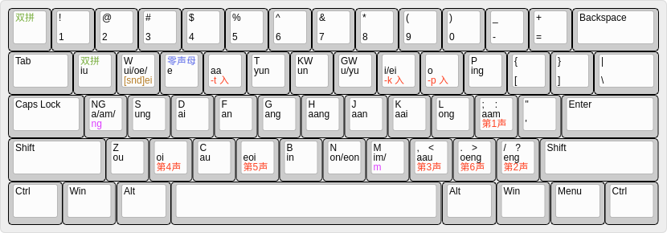
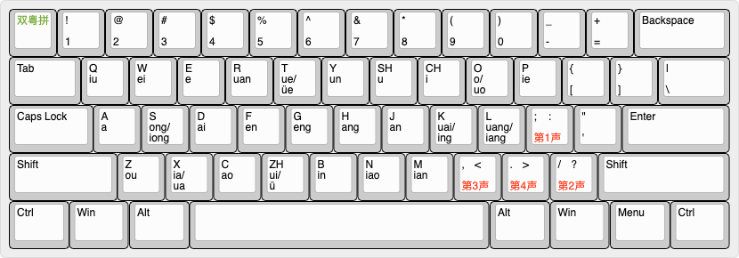

# fcitx-rime-config

This repository includes my Double Jyutping with Optional Tones IME for [RIME](https://rime.im/), Flypy Double Pinyin with Optional Tones, as well as a number of other input methods for RIME.

## Double Jyutping with Optional Tones

All syllables in Cantonese (粤语 / 广东话) can be entered unambiguously with 2 keystrokes (or 3 for entering tone, ie ending with -p -t -k).

You can optionally enter a tone with 1 additional keystroke - 1 is `;`, 2 is `/`, 3 is `,`, 4 is `x`, 5 is `v`, 6 is `.`

"ng" is entered by typing `aa`

"m" is entered by typing `mm`

Syllables ending in -p -t -k are entered with 3 keys, where the last one is either `r` (for -t), `i` (for -k) or `o` (for -p). For example, "gat" is `gar`, "faat" is `frr`, "gik" is `gii`, "ngok" is `aoi`, "goek" is `gwi`

For initials which can be followed by either i or ei (d, n, s), -ei gets relocated to the `w` key. So "sei" is `sw` but "si" is `si`. For all other initials (g, f, k, p, b, m, l), -ei remains on the `i` key, so "gui" is `gw` and "gei" is `gi`.

It is implemented by double-jyutping.schema.yaml in this repository. The [keyboard layout diagram](http://www.keyboard-layout-editor.com/) is double-jyutping.json.

## Flypy Double Pinyin with Optional Tones

This is identical to the standard Flypy Double Pinyin 小鹤双拼 and adds the ability to use the keys ;/,. to optionally enter tones 1234 respectively.

All syllables in Standard Chinese (Mandarin / Putonghua / 普通话)

It is implemented by td_pinyin_flypy_jyutping.schema.yaml in this repository. The [keyboard layout diagram](http://www.keyboard-layout-editor.com/) is double-flypy.json

## License

MIT License

## Author

[Geza Kovacs](https://github.com/gkovacs)
